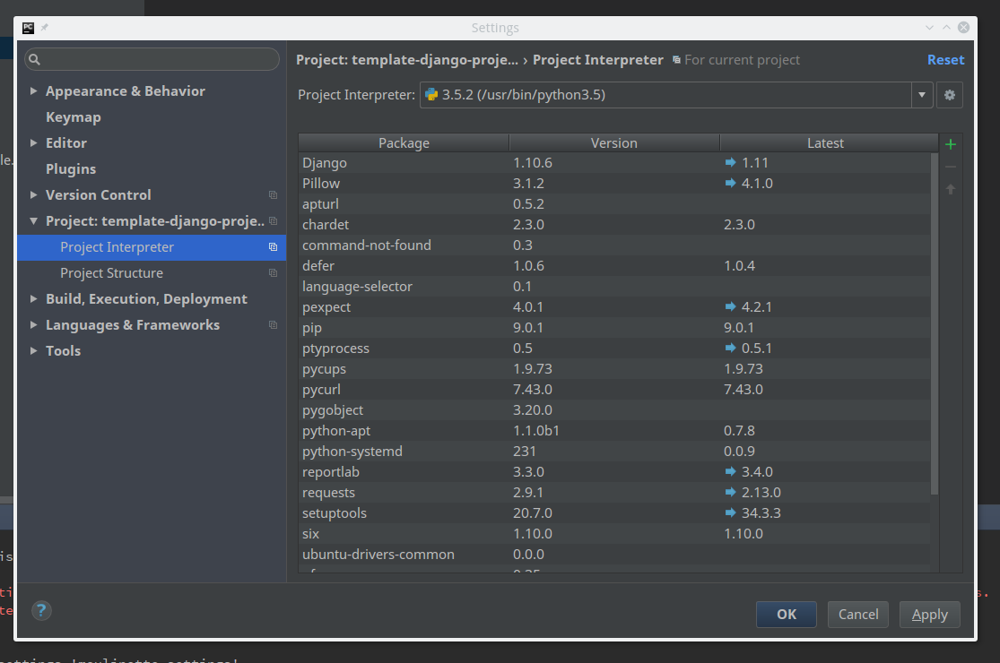
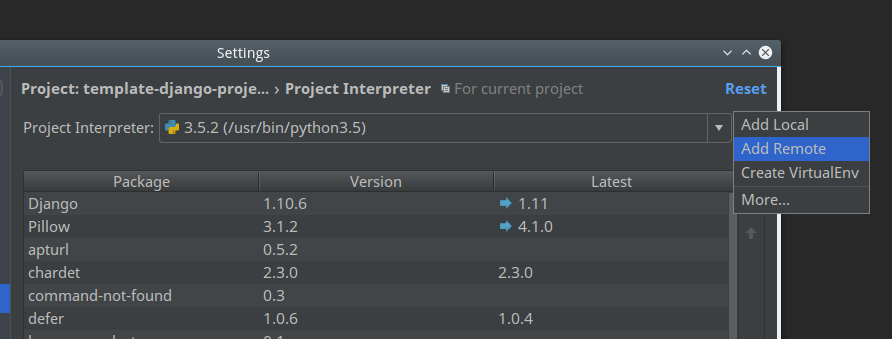
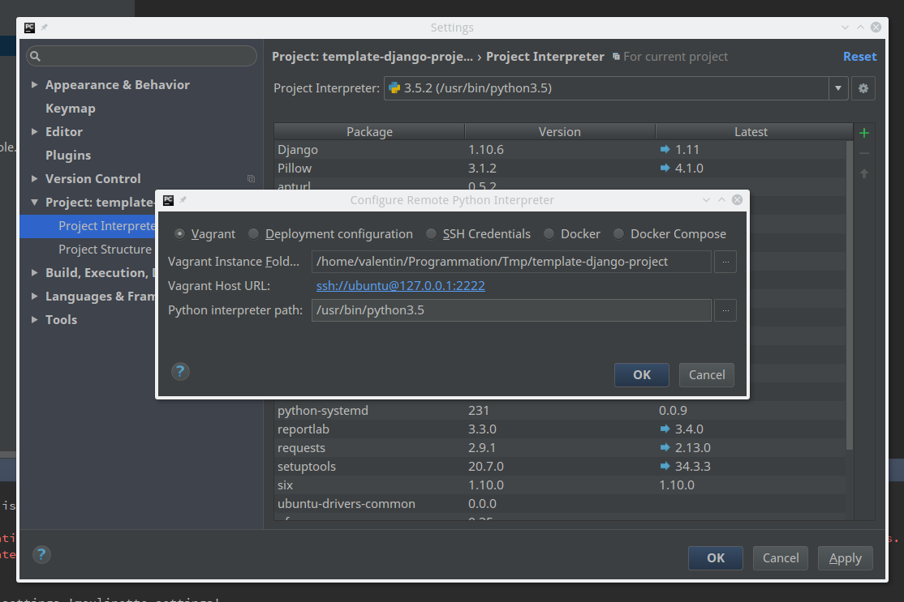
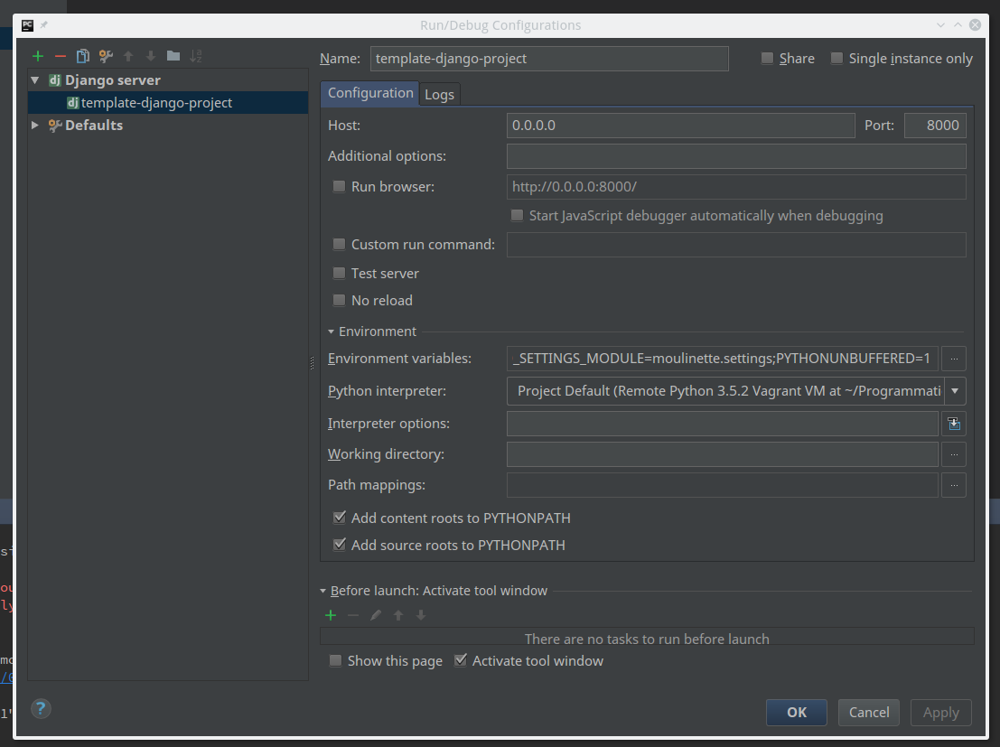

# template-django-project
Template for Django project running in vagrant.

Nous utilisons vagrant pour installer les dépendances dans une machine virtuelle,
vous pouvez l'obtenir ici : [Télécharger vagrant](https://www.vagrantup.com/downloads.html)

### Développer avec Pycharm

1. [Télécharger pycharm](https://www.jetbrains.com/pycharm/download) si ce n'est pas déjà fait

2. Lancez pycharm et sélectionnez le chemin du dossier 'django_rest_application'.

3. Accédez au paramètres depuis les onglets ou avec le raccourcis "CTRL + ALT + S". Sélectionnez "Project: django_rest_application" puis sélectionnez "Project Interpreter"



4. Sélectionner la petite icone rouage en haut à droite et cliquez sur "add remote"



5. Cliquez sur vagrant en haut à gauche de la nouvelle fenêtre et sélectionnez le répertoire courant du dossier de votre projet "django_rest_application". Ensuite ajoutez spécifiez dans le champs "python interpreter path" la version "/usr/bin/python3.5" puis attendez le temps que Pycharm mette à jour les ressources.



6. Ensuite retournez à l'éditeur, et cliquez sur "django_rest_application" pour changer et editer la configuration


7. Maintenant éditez la configuration, pour cela il faut modifier le champs 'host: 0.0.0.0' et vérifier que le port est bien '8000'. Ensuite allez sur le champs 'python interpreter' et sélectionnez 'Project default'.



8. Voila, vous pouvez maintenant lancer votre première application en cliquant sur le bouton run en haut à droite (le triangle vert) et vous rendre sur l'url localhost:8000 depuis votre navigateur

### Commandes

**Lancez le serveur Django depuis l'host**
```
vagrant ssh -c "/usr/bin/python3.5 -u $DJANGO_DIR/manage.py runserver 0.0.0.0:8000"
```

**Lancer le serveur Django depuis la machine virtuelle**
```
vagrant ssh
python3.5 $DJANGO_DR/manage.py runserver 0.0.0.0:8000
```

**Lancer les migrations depuis l'host**
```
vagrant ssh -c "/usr/bin/python3.5 -u $DJANGO_DIR/manage.py makemigrations"
vagrant ssh -c "/usr/bin/python3.5 -u $DJANGO_DIR/manage.py migrate"
```

**Lancer les migrations depuis la machine virtuelle**
```
vagrant ssh
python3.5 $DJANGO_DIR/manage.py makemigrations
python3.5 $DJANGO_DIR/manager.py migrate
```
